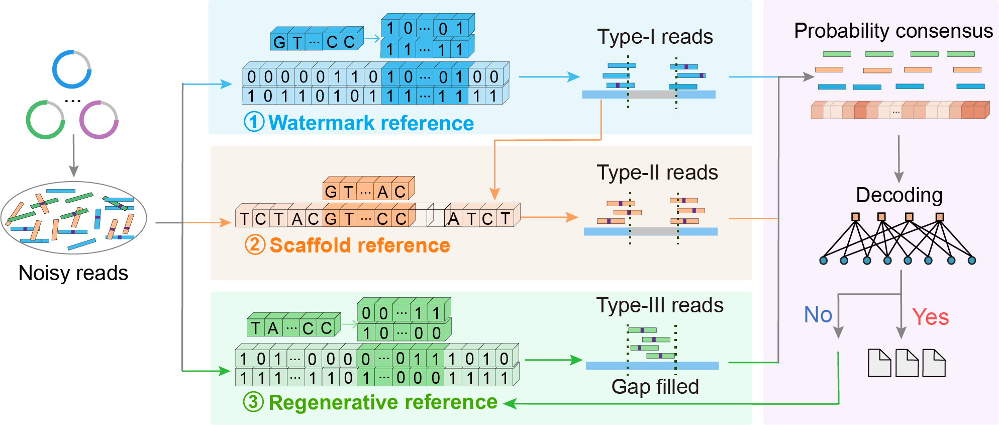

# Fast bootstrap and reliable readout using hidden references for DNA data storage



## Table of Contents

- [Fast bootstrap and reliable readout using hidden references for DNA data storage](#fast-bootstrap-and-reliable-readout-using-hidden-references-for-dna-data-storage)
  - [Table of Contents](#table-of-contents)
  - [Overview](#overview)
  - [Requirements](#requirements)
  - [Kit Tree Diagram](#kit-tree-diagram)
  - [Modules](#modules)
  - [Example of usage](#example-of-usage)
    - [1. R0.67\_fast\_recovery](#1-r067_fast_recovery)
    - [2. R0.83\_bootstrap\_recovery](#2-r083_bootstrap_recovery)
  - [Note](#note)
  - [License](#license)

## Overview

Synthetic DNA is becoming a promising data storage medium for future large-scale data archiving. However, data
readout from massive, unordered sequencing reads requires alignment based on overlapping regions and is complicated by diverse sequencing errors. We propose a multi-stage alignment and error correction strategy via multiple-fold hidden references, transforming the de novo readout into a resequencing-like workflow. The proposed scheme is compatible with various NGS platforms, maximizes the utilization of sequencing reads, and enables assembly-free data readout under low sequencing coverage. We provide code for readout pipelines under different error conditions, divided into two main parts：

1. **Fast recovery**: In low-error-rate scenarios, reads are identified via sliding correlation with the watermark reference. Bit-wise consensus generates soft-decision information for fast data recovery.
2. **Bootstrap recovery**: In the presence of indels, reads with distinct features are progressively identified using multiple-fold references. The forward-backward algorithm is employed to generate indel-corrected probability information for soft-decision decoding.

The entire software is implemented in C and C++, with input and output files provided alongside the program. Executable calls are organized into modular shell scripts, enabling easy and flexible deployment across different Linux distributions.

We designed and synthesized four ~40 kb large DNA fragments using watermark superposition coding, respectively encoding Tagore's poem *Dreams* (DNA-40.5Kb-DR, R = 1/4), the emblem of Tianjin University (DNA-40.5Kb-EM, R = 2/3), and the images *Earthrise* (DNA-40.32Kb-ER, R = 1/2) and *Milk Coronet* (DNA-40.5Kb-MC, R = 5/6).We provide both raw sequencing reads generated by Illumina and simulated reads generated using the ART simulator. For  fast recovery , we include the corresponding data files and programs for DNA-40.5Kb-EM (R = 2/3) and  DNA-40.32Kb-ER (R = 1/2) . For  bootstrap recovery , we provide the data files and programs for DNA-40.32Kb-ER (R = 1/2) and DNA-40.5Kb-MC (R = 5/6) that support error-free decoding.

## Requirements

**OS Requirements**

The program has been tested on the following operating systems:

- **Ubuntu 18.04.6 LTS**
- **Ubuntu 20.04.6 LTS**

**Software Requirements**

The following tools and dependencies are required:

- **C Compilers:** Ensure gcc is installed.
- **C++ Compilers:** Ensure g++ is installed.
- **Edlib**: The Edlib should be available for sequence alignment. You can download it from the official repository: https://github.com/Martinsos/edlib

## Kit Tree Diagram

```html

├── data                                        // Data module
│    ├── R0.5
│    ├──  ├──sourceBITearth4KB4032.txt          // Original binary bitstream
│    ├──  ├──DNA-40.32Kb-ER_Sim.fastq           // ART simulation data
│    ├──  ├──DNA-40.32Kb-ER_SE150.fastq         // Sequencing data
│    ├──  ├──original_seq-ER.txt                // Encoded payload sequence
│    ├──  ├──sequenceL80640NoPeriod2FILE        // Watermark sequence
│    ├──  ├──encoded_bit.txt                    // Encoded bit sequence
│    ├── R0.67
│    ├──  ├──source_bit.txt                     // Original binary bitstream
│    ├──  ├──DNA-40.5Kb-EM_SE150.fastq          // Sequencing data
│    ├──  ├──original_seq-EM.txt                // Encoded payload sequence
│    ├──  ├──SequenceLengthALL_FILE001R0667     // Watermark sequence
│    ├──  ├──encoded_bit.txt                    // Encoded bit sequence
│    ├── R0.83
│    ├──  ├──source_bit.txt                     // Original binary bitstream
│    ├──  ├──DNA-40.5Kb-MC_Sim.fastq            // ART simulation data
│    ├──  ├──original_seq-MC.txt                // Encoded payload sequence
│    ├──  ├──SequenceL81000NoPeriodOnly2ndFILE  // Watermark sequence
│    ├──  ├──encoded_bit.txt                    // Encoded bit sequence

├── fast_recovery                               // Fast recovery module
│    ├── edlib                                  // Edlib alignment library (dependency)
│    ├── NLDPC_R05_configure                    // Decoding configuration files (R = 0.5)
│    ├── sliding_correlation.c                  // Performs sliding correlation with watermark reference
│    ├── bit-wise_consensus_recovery.c          // Generates consensus bitstream from aligned reads
│    ├── post_dec_hamming_dis.c                 // Calculates Hamming distance
│    ├── NLDPC_R1_2_soft_decoder                // Non-binary LDPC soft-decision decoder (R = 0.5)
│    ├── LDPC_R2_3_soft_decoder                 // Binary LDPC soft-decision decoder (R = 0.67)

├── bootstrap_recovery                          // Bootstrap recovery module
│    ├── edlib                                  // Edlib alignment library (dependency)
│    ├── NLDPC_R05_configure                    // Decoding configuration files (R = 0.5)
│    ├── sliding_correlation.c                  // Performs sliding correlation with watermark reference
│    ├── align_bits.cpp                         // Aligns reads to regenerative reference at the bit level
│    ├── dec_result_feedback.cpp                // Refines soft decoding results with feedback
│    ├── get_reads_bits.c                       // Converts read sequences into dual-layer A/T base strings
│    ├── get_ref_bits.c                         // Converts regenerative reference into dual-layer A/T base strings
│    ├── getthre.c                              // Extracts peak values for adaptive thresholding
│    ├── lowthres_pthread_edlib.c               // Aligns reads to scaffold reference
│    ├── majorityvoting.c                       // Builds scaffold sequence via base-wise majority voting
│    ├── post_dec_hamming_dis.c	                // Calculates Hamming distance
│    ├── R1_2_indel_correct                     // Forward-backward algorithm for indel correction (R = 0.5)
│    ├── R5_6_indel_correct                     // Forward-backward algorithm for indel correction (R = 0.83)
│    ├── R1_2_multi-read_merging                // Merges symbol probabilities to compute consensus soft information (R = 0.5)
│    ├── R5_6_multi-read_merging                // Merges symbol probabilities to compute consensus soft information (R = 0.83)
│    ├── NLDPC_R1_2_soft_decoder                // Non-binary LDPC soft-decision decoder (R = 0.5)
│    ├── LDPC_R5_6_soft_decoder                 // Binary LDPC soft-decision decoder (R = 0.83)

├── R0.5_fast_recovery.sh                       // Shell script to run fast recovery (R = 0.5)
├── R0.67_fast_recovery.sh                      // Shell script to run fast recovery (R = 0.67)
├── R0.5_bootstrap_recovery.sh                  // Shell script to run bootstrap recovery (R = 0.5)
├── R0.83_bootstrap_recovery.sh                 // Shell script to run bootstrap recovery (R = 0.83)
├── README.md                                   // Documentation for the toolkit

```

## Modules

| Program                     | Input                                                                                                                                                  | Output                                                                                                                                                                                                                                                               |
| --------------------------- | ------------------------------------------------------------------------------------------------------------------------------------------------------ | -------------------------------------------------------------------------------------------------------------------------------------------------------------------------------------------------------------------------------------------------------------------- |
| R0.67_fast_recovery.sh      | DNA-40.5Kb-EM-SE150_1.fastq<br />SequenceLengthALL_FILE001R0667<br />original_seq-EM.txt<br />source_bit.txt<br />permutation64800                     | correlation_result.txt<br />err_of_dec_result.txt<br />recovery_bitstream.txt<br />recovery_image.jpg                                                                                                                                                                |
| R0.83_bootstrap_recovery.sh | DNA-40.5Kb-MC_Sim.fastq<br />SequenceL81000NoPeriodOnly2ndFILE<br />encoded_bit.txt<br />original_seq-MC.txt<br />source_bit.txt<br />permutation64800 | correlation_result.txt<br />Type-I_reads.txt<br />Type-II_reads.txt<br />Type-III_reads.txt<br />scaffold_ref.txt<br />dec_result.txt<br />soft_infor.txt<br />symbol_probability.txt<br />err_of_dec_result.txt<br />recovery_bitstream.txt<br />recovery_image.jpg |

## Example of usage

### 1. R0.67_fast_recovery

**Command:**

```bash
./R0.67_fast_recovery.sh
```

**Input files:**

- **DNA-40.5Kb-EM_SE150.fastq**: Illumina sequencing data with a length of 150 nt.
- **SequenceLengthALL_FILE001R0667**: Watermark sequence embedded in the encoded large DNA fragment with a length of 81,000 bits.
- **original_seq-EM.txt**: Encoded payload sequence with a length of 40,500 nt.
- **source_bit.txt**: Binary bitstream of the original data with a length of 43,200 bits.
- **permutation64800**: Interleaving index used for permuting the bitstream.

**Output files:**

- **correlation_result.txt**: Sliding correlation result including sequencing reads, peak values, positions and directions.
- **err_of_dec_result.txt**: Result of substitution error between the decoded binary bits and the source bitstream, with two columns indicating the error count and error rate, respectively.
- **recovery_bitstream.txt**: Decoded binary data bitstream with a length of 43,200 bits.
- **recovery_image.jpg**: Original image of the decoded output.

---

### 2. R0.83_bootstrap_recovery

**Command:**

```bash
./R0.83_bootstrap_recovery.sh
```

**Input files:**

- **DNA-40.5Kb-MC_Sim.fastq**: Simulation data of 150 nt obtained using ART software.
- **SequenceL81000NoPeriodOnly2ndFILE**: Watermark sequence embedded in the encoded large DNA fragment with a length of 81,000 bits.
- **encoded_bit.txt**: Codeword sequence of 64,800 bits encoded using LDPC (64800, 54000) code.
- **original_seq_MC.txt**: Encoded payload sequence with a length of 40,500 nt.
- **source_bit.txt**: Binary bitstream of the original data with a length of 54,000 bits.
- **permutation64800**: Interleaving index used for permuting the bitstream.

**Output files:**

- **correlation_result.txt**: Sliding correlation result including sequencing reads, peak values, positions and directions.
- **Type-I_reads.txt**: Sequencing reads filtered by watermark reference.
- **Type-II_reads.txt**: Sequencing reads filtered by scaffold reference.
- **Type-III_reads.txt**:  Sequencing reads filtered by regenerative reference.
- **scaffold_ref.txt**: Majority voting result for correlation-filtered reads with a length of 40,500 nt.
- **dec_result.txt**: Decoded binary sequence with a length of 64,800 bits.
- **soft_infor.txt**: Consensus soft information obtained after probability combination, with two columns indicating the probabilities of “1” and “0”, respectively.
- **symbol_probability.txt**: Result of indel correction, where each set of three lines records the start position, length, and soft information of an encoded symbol.
- **err_of_dec_result.txt**: Result of substitution error between the decoded binary bits and the source bitstream, with two columns indicating the error count and error rate, respectively.
- **recovery_bitstream.txt**: Decoded binary data bitstream with a length of 54,000 bits.
- **recovery_image.jpg**: Original image of the decoded output.

## Note

For comprehensive information on the structural design, coding scheme, and sequencing data information of the yeast artificial chromosome in this study, please refer to the literature:

Chen, W.G., Han, M.Z., Zhou, J.T., Ge, Q., Wang, P.P., Zhang, X.C., Zhu, S.Y., Song, L.F., and Yuan, Y.J. (2021) An artificial chromosome for data storage. Natl. Sci. Rev., 8, nwab028.

## License

Distributed under the MIT License. See LICENSE for more information.
