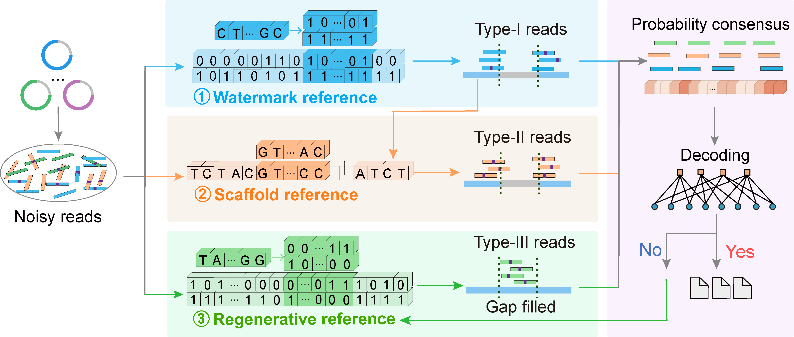

# Fast bootstrap and reliable readout using hidden references for DNA data storage



## Table of Contents

- [Overview](#overview)
- [Requirements](#requirements)
- [Kit Tree Diagram](#kit-tree-diagram)
- [Example of usage](#example-of-usage)
  - [1. Fast Recovery (R = 2/3)](#1-fast-recovery-r--23)
  - [2. Bootstrap Recovery stage 1 only (R = 5/6)](#2-bootstrap-recovery-stage-1-r--56)
  - [3. Bootstrap Recovery stages 1+2 (R = 5/6)](#3-bootstrap-recovery-stages-12-r--56)
  - [4. Bootstrap Recovery stages 1+2+3 (R = 5/6)](#4-bootstrap-recovery-stages-123-r--56)
- [Note](#note)
- [License](#license)

## Overview

Synthetic DNA is becoming a promising data storage medium for future large-scale data archiving. However, data readout from massive, unordered sequencing reads requires alignment based on overlapping regions and is complicated by diverse sequencing errors. We propose a multi-stage alignment and error correction strategy via multiple-fold hidden references, transforming the de novo readout into a resequencing-like workflow. The proposed scheme is compatible with various NGS platforms, maximizes the utilization of sequencing reads, and enables assembly-free data readout under low sequencing coverage. We provide code for readout pipelines under different error conditions, divided into two main parts：

1. **Fast recovery**: In low-error-rate scenarios, the pipeline identifies reads via sliding correlation with the watermark reference. Bit-wise consensus rapidly generates soft-decision information for LDPC decoding.
2. **Bootstrap recovery**: In the presence of indels, the pipeline progressively identifies reads with distinct features using multiple-fold references. The forward-backward algorithm is employed to generate indel-corrected probability information to enable reliable readout.

To facilitate evaluation and demonstration, we decompose the bootstrap recovery into three incremental workflows:

- Stage 1 only: initial recovery based on hidden watermark reference.
- Stages 1+2: includes scaffold reference-assisted refinement.
- Stages 1+2+3: full pipeline with regenerative reference for final enhancement.

The entire software is implemented in C and C++, with input and output files provided alongside the program. Executable calls are organized into modular shell scripts, enabling easy and flexible deployment across different Linux distributions.

We designed and synthesized four ~40 kb DNA sequences at different LDPC code rates: DNA-40.5Kb-DR (R = 1/4), DNA-40.5Kb-EM (R = 2/3), DNA-40.32Kb-ER (R = 1/2), and DNA-40.5Kb-MC (R = 5/6). We provide the corresponding data and decoding programs to support both fast and bootstrap recovery across all four code rates, enabling accurate readout under diverse error conditions.

## Requirements

**OS Requirements**

The program has been tested on the following operating systems:

- **Ubuntu 18.04.6 LTS**
- **Ubuntu 20.04.6 LTS**

**Software Requirements**

The following tools and dependencies are required:

- **C Compilers:** Ensure gcc is installed.
- **C++ Compilers:** Ensure g++ is installed.
- **Edlib**: The Edlib should be available for sequence alignment. You can download it from the official repository: https://github.com/Martinsos/edlib

## Kit Tree Diagram

```
.
├── fast_recovery/                                # Fast recovery modules for four code rates
│   ├── R0.25_fast_recovery/                      # Fast recovery for R = 1/4
│   ├── R0.5_fast_recovery/                       # Fast recovery for R = 1/2
│   ├── R0.67_fast_recovery/                      # Fast recovery for R = 2/3
│   └── R0.83_fast_recovery/                      # Fast recovery for R = 5/6
│       ├── bin/                                  # Compiled binaries
│       ├── src/                                  # Source code
│       ├── configure/                            # Watermark and decoding parameter files
│       ├── sequencing_data/                      # Sequencing reads (FASTQ format)
│       ├── Compile.sh                            # Compilation script
│       └── Fast_recovery.sh                      # One-stage fast recovery

├── bootstrap_recovery_stage1/                    # Bootstrap recovery stage 1 modules for four code rates
│   ├── R0.25_bootstrap_recovery_stage1/          # Bootstrap recovery stage 1 for R = 1/4
│   ├── R0.5_bootstrap_recovery_stage1/           # Bootstrap recovery stage 1 for R = 1/2
│   ├── R0.67_bootstrap_recovery_stage1/          # Bootstrap recovery stage 1 for R = 2/3
│   └── R0.83_bootstrap_recovery_stage1/          # Bootstrap recovery stage 1 for R = 5/6
│       ├── bin/                                  # Compiled binaries
│       ├── src/                                  # Source code
│       ├── configure/                            # Watermark and decoding parameter files
│       ├── sequencing_data/                      # Sequencing reads (FASTQ format)
│       ├── Compile.sh                            # Compilation script
│       └── Bootstrap_recovery_stage1.sh          # Run stage 1 of bootstrap recovery

├── bootstrap_recovery_stage1_2/                  # Bootstrap recovery stage 1+2 modules for four code rates
│   ├── R0.25_bootstrap_recovery_stage1_2/        # Bootstrap recovery stage 1+2 for R = 1/4
│   ├── R0.5_bootstrap_recovery_stage1_2/         # Bootstrap recovery stage 1+2 for R = 1/2
│   ├── R0.67_bootstrap_recovery_stage1_2/        # Bootstrap recovery stage 1+2 for R = 2/3
│   └── R0.83_bootstrap_recovery_stage1_2/        # Bootstrap recovery stage 1+2 for R = 5/6
│       ├── bin/                                  # Compiled binaries
│       ├── src/                                  # Source code
│       ├── configure/                            # Watermark and decoding parameter files
│       ├── sequencing_data/                      # Sequencing reads (FASTQ format)
│       ├── Compile.sh                            # Compilation script
│       └── Bootstrap_recovery_stage1_2.sh        # Run stages 1+2 of bootstrap recovery

├── bootstrap_recovery_stage1_2_3/                # Bootstrap recovery stage 1+2+3 modules for four code rates
│   ├── R0.25_bootstrap_recovery_stage1_2_3/      # Bootstrap recovery stage 1+2+3 for R = 1/4
│   ├── R0.5_bootstrap_recovery_stage1_2_3/       # Bootstrap recovery stage 1+2+3 for R = 1/2
│   ├── R0.67_bootstrap_recovery_stage1_2_3/      # Bootstrap recovery stage 1+2+3 for R = 2/3
│   └── R0.83_bootstrap_recovery_stage1_2_3/      # Bootstrap recovery stage 1+2+3 for R = 5/6
│       ├── bin/                                  # Compiled binaries
│       ├── src/                                  # Source code
│       ├── configure/                            # Watermark and decoding parameter files
│       ├── sequencing_data/                      # Sequencing reads (FASTQ format)
│       ├── Compile.sh                            # Compilation script
│       └── Bootstrap_recovery_stage1_2_3.sh      # Run stages 1+2+3 of bootstrap recovery
```

## Example of usage

### 1. Fast Recovery (R = 2/3)

**Command:**

```bash
cd ./R0.67_fast_recovery/ 
./Compile.sh
./Fast_recovery.sh
```

#### [Step 1] Sliding correlation

**Input files:**

- `SequenceLengthALL_FILE001R0667` – known watermark sequence
- `DNA-40.5Kb-EM_SE150.fastq` – real sequencing data with a raw error rate of 0.5%

**Output files:**

- `correlation_result.txt` – read alignment information including read sequence, correlation peak value, alignment position relative to the watermark, and strand orientation

#### [Step 2] Bit-wise majority voting

**Input files:**

- `SequenceLengthALL_FILE001R0667` – known watermark sequence
- `correlation_result.txt` – read alignment information from Step 1

**Output files:**

- `soft_info.txt` – consensus soft information with two columns: probability of "1" and "0" at each bit position

#### [Step 3] Soft-decision LDPC decoding

**Input files:**

- `soft_info.txt` – consensus soft information from Step 2

**Output files:**

- `recovery_image.jpg` – reconstructed image
- `recovery_bitstream.txt` – decoded binary stream (43,200 bits)

Fast recovery workflows for other code rates (R = 1/4, 1/2, and 5/6) are provided and follow the same structure and usage as the R = 2/3 example.

---

### 2. Bootstrap Recovery stage 1 only (R = 5/6)

**Command:**

```bash
cd ./R0.83_bootstrap_recovery_stage1/
./Compile.sh
./Bootstrap_recovery_stage1.sh
```

#### [Step 1] Sliding correlation

**Input files:**

- `SequenceL81000NoPeriodOnly2ndFILE` – known watermark sequence
- `DNA-40.5Kb-MC-Sim.fastq` – simulated sequencing data with a raw error rate of 1.2% (including 0.6% indels)

**Output files:**

- `correlation_result.txt` – read alignment information including read sequence, correlation peak, alignment position relative to the watermark, and strand orientation
- `Type-I_reads.txt` – high-correlation reads with no indels or indels near the ends
- `lowthres_reads.txt` – low-correlation reads that typically carried internal indel errors

#### [Step 2] Forward-backward algorithm (FBA)

**Input files:**

- `SequenceL81000NoPeriodOnly2ndFILE` – known watermark sequence
- `Type-I_reads.txt` – high-correlation reads from Step 1

**Output files:**

- `symbol_probability.txt` – indel-corrected symbol probability (from Type-I reads)

#### [Step 3] Consensus soft information generation

**Input files:**

- `SequenceL81000NoPeriodOnly2ndFILE` – known watermark sequence
- `symbol_probability.txt` – indel-corrected symbol probability from Step 2

**Output files:**

- `soft_info.txt` – consensus soft information (from Type-I reads)

#### [Step 4] Soft-decision LDPC decoding

**Input files:**

- `soft_info.txt` – consensus soft information from Step 3

**Output files:**

- `recovery_image.jpg` – reconstructed image
- `recovery_bitstream.txt` – decoded binary stream (54,000 bits)
- `decodedCodeword.txt` – decoded full LDPC codeword including systematic and parity bits (64,800 bits)

---

### 3. Bootstrap Recovery stages 1+2 (R = 5/6)

**Command:**

```bash
cd ./R0.83_bootstrap_recovery_stage1_2/
./Compile.sh
./Bootstrap_recovery_stage1_2.sh
```

#### ➤ Stage 1: *(see above)*

#### ➤ Stage 2:

#### [Step 1–2] Scaffold reference generation and filtering Type-II reads

**Input files:**

- `Type-I_reads.txt` – high-correlation reads from Stage 1
- `lowthres_reads.txt` – low-correlation reads remaining from Stage 1

**Output files:**

- `TypeII_reads.txt` – Type-II reads that typically carried internal indel errors
- `stage2_residual_reads.txt` – reads not aligned to the scaffold reference (filtered out)

#### [Step 3–5] FBA, consensus, and decoding

**Input files:**

- `SequenceL81000NoPeriodOnly2ndFILE` – known watermark sequence
- `TypeII_reads.txt` – Type-II reads from Step 2

**Output files:**

- `recovery_image.jpg` – reconstructed image
- `recovery_bitstream.txt` – decoded binary stream (54,000 bits)
- `decodedCodeword.txt` – decoded full LDPC codeword including systematic and parity bits (64,800 bits)

---

### 4. Bootstrap Recovery stages 1+2+3 (R = 5/6)

**Command:**

```bash
cd ./R0.83_bootstrap_recovery_stage1_2_3/
./Compile.sh
./Bootstrap_recovery_stage1_2_3.sh
```

#### ➤ Stage 1 and Stage 2: *(see above)*

#### ➤ Stage 3:

#### [Step 1–2] Regenerative reference generation and filtering Type-III reads

**Input files:**

- `SequenceL81000NoPeriodOnly2ndFILE` – known watermark sequence
- `decodedCodeword.txt` – decoded codeword from Stage 2
- `stage2_residual_reads.txt` – reads not aligned to the scaffold reference from Stage 2

**Output files:**

- `TypeIII_reads.txt` – reads typically aligned to gap regions, identified during the final recovery stage

#### [Step 3–5] FBA, consensus, and decoding

**Input files:**

- `SequenceL81000NoPeriodOnly2ndFILE` – known watermark sequence
- `TypeIII_reads.txt` – Type-III reads from Step 1

**Output files:**

- `recovery_image.jpg` – reconstructed image
- `recovery_bitstream.txt` – decoded binary stream (54,000 bits)
- `decodedCodeword.txt` – decoded full LDPC codeword including systematic and parity bits (64,800 bits)

In addition, each bootstrap recovery workflow logs summary statistics for every independent experiment in:

`./R0.83_bootstrap_recovery_stage1_2_3/results/recovery_status.txt`

This file contains seven columns:

1. Experiment ID
2. Erasure rate
3. Substitution error rate
4. Recovery stage (0 = failure, 1 = stage 1, 2 = stage 2, 3 = stage 3)
5. Number of Type-I reads
6. Number of Type-II reads
7. Number of Type-III reads

The bootstrap recovery workflow for other code rates (R = 1/4, 1/2, and 2/3) is provided and follows the same structure and usage as the R = 5/6 example.

## Note

For comprehensive information on the coding scheme in this study, please refer to the literature:

Chen, W.G., Han, M.Z., Zhou, J.T., Ge, Q., Wang, P.P., Zhang, X.C., Zhu, S.Y., Song, L.F., and Yuan, Y.J. (2021) An artificial chromosome for data storage. Natl. Sci. Rev., 8, nwab028.

## License

This project is licensed under the MIT License. See the [LICENSE] file for details.
